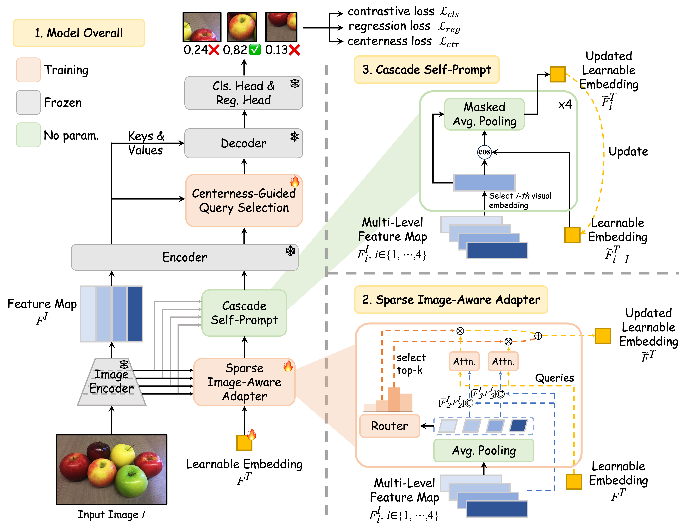

# 🚀 [PF-RPN: Prompt-Free Universal Region Proposal Network (CVPR 2026)](https://arxiv.org/abs/2603.17554)

<div align="center">
<br>
<a>Qihong Tang</a><sup><span>1,*</span></sup>, 
<a>Changhan Liu</a><sup><span>1*</span></sup>,
<a>Shaofeng Zhang</a><sup><span>2</span></sup>,
<a>Wenbin Li</a><sup><span>1</span></sup>,
<a>Qi Fan</a><sup><span>1,📧</span></sup>,
<a>Yang Gao</a><sup><span>1</span></sup>
</br>

\* Equal contribution  📧 Corresponding author

<sup>1</sup> Nanjing University,  <sup>2</sup> University of Science and Technology of China
</br>
[](https://huggingface.co/tangqh/PF-RPN)
[](https://arxiv.org/abs/2603.17554)
[](https://github.com/open-mmlab/mmdetection)
[](https://www.python.org/)
[](https://pytorch.org/)
[](https://developer.nvidia.com/cuda-toolkit)
</div>

> Official implementation of **PF-RPN** built on MMDetection.

## 📌 News

- `2026-03-11`: 🧩Codebase and pretrained checkpoint released.
- `2026-02-21`: 🎉Our paper has been accepted by **CVPR 2026**!

## ✨ Highlights

- ✅ Prompt-free open-set proposal generation with a unified class token (`object`)
- ✅ Strong AR on both CD-FSOD and ODinW13
- ✅ End-to-end training/evaluation pipeline based on MMDetection
- ✅ One-class annotation generation script for reproducible protocol

## 🧠 Abstract

Open-vocabulary detectors usually rely on text prompts (class names), which can be unavailable, noisy, or domain-sensitive in deployment. PF-RPN revisits region proposal generation under a **prompt-free** setting, where all categories are unified into a single token (`object`).

PF-RPN improves proposal quality with three key designs:

- **Sparse Image-Aware Adapter**: pseudo text construction from multi-level visual features.
- **Cascade Self-Prompt**: iterative visual-text enhancement via masked pooling.
- **Centerness-Guided Query Selection**: top-k decoder query selection using joint confidence.

## 🏗️ Model Overview

<p align="center">
  
</p>

## 📊 Main Results

PF-RPN achieves state-of-the-art AR under prompt-free evaluation on both CD-FSOD and ODinW13.

| Dataset | Method | Prompt Free | AR100 | AR300 | AR900 | ARs | ARm | ARl |
|---|---|---:|---:|---:|---:|---:|---:|---:|
| CD-FSOD | GDINO† | ✗ | 52.9 | 53.5 | 54.7 | 31.1 | 41.6 | 63.9 |
| CD-FSOD | GDINO‡ | ✓ | 54.7 | 57.8 | 61.6 | 34.1 | 49.3 | 67.0 |
| CD-FSOD | YOLOE-v8-L† | ✗ | 44.4 | 46.2 | 47.1 | 21.6 | 36.6 | 54.9 |
| CD-FSOD | YWorldv8-L† | ✗ | 49.6 | 51.1 | 51.6 | 25.1 | 42.7 | 60.6 |
| CD-FSOD | Qwen-VL† | ✗ | 20.1 | 20.1 | 20.1 | 1.0 | 3.0 | 26.5 |
| CD-FSOD | GLIP† | ✗ | 47.6 | 47.6 | 47.6 | 21.2 | 34.6 | 56.0 |
| CD-FSOD | GenerateU | ✓ | 47.7 | 54.1 | 55.7 | 28.1 | 48.3 | 69.4 |
| CD-FSOD | Open-Det | ✓ | 36.6 | 46.3 | 54.3 | 28.2 | 45.3 | 67.7 |
| CD-FSOD | RPN | ✓ | 32.0 | 39.0 | 45.7 | 29.9 | 43.0 | 54.3 |
| CD-FSOD | Cascade RPN | ✓ | 45.8 | 52.0 | 56.9 | 31.1 | 50.5 | 66.0 |
| CD-FSOD | **PF-RPN (Ours)** | **✓** | **60.7** | **65.3** | **68.2** | **38.5** | **61.9** | **80.3** |
| ODinW13 | GDINO† | ✗ | 72.1 | 73.4 | 74.0 | **45.6** | 61.7 | 79.2 |
| ODinW13 | GDINO‡ | ✓ | 69.1 | 70.9 | 72.4 | 40.8 | 64.6 | 78.4 |
| ODinW13 | YOLOE-v8-L† | ✗ | 66.6 | 67.8 | 68.3 | 39.2 | 57.8 | 72.8 |
| ODinW13 | YWorldv8-L† | ✗ | 69.1 | 70.3 | 71.5 | 37.5 | 62.2 | 75.4 |
| ODinW13 | GLIP† | ✗ | 69.8 | 69.8 | 69.8 | 33.2 | 50.9 | 75.2 |
| ODinW13 | GenerateU | ✓ | 67.3 | 71.5 | 72.2 | 32.8 | 63.1 | 80.0 |
| ODinW13 | Open-Det | ✓ | 53.9 | 62.9 | 69.1 | 27.7 | 59.8 | 76.6 |
| ODinW13 | RPN | ✓ | 49.0 | 52.4 | 55.7 | 35.3 | 54.0 | 59.8 |
| ODinW13 | Cascade RPN | ✓ | 60.9 | 65.5 | 70.2 | 40.3 | 65.5 | 75.0 |
| ODinW13 | **PF-RPN (Ours)** | **✓** | **76.5** | **78.6** | **79.8** | 45.4 | **71.9** | **85.8** |

- `†` uses original class names as text prompts.
- `‡` replaces class names with `object` (prompt-free setting).

## 🧩 Release Status

- [x] Training / evaluation code
- [x] PF-RPN checkpoint
- [x] Data preprocessing utility (`tools/merge_classes_and_sample_subset.py`)

## ⚙️ Installation

Validated environment:

- Python 3.10
- CUDA 11.8
- PyTorch 2.1.0

```bash
# 1) Create environment
conda create -n pf-rpn python=3.10 -y
conda activate pf-rpn

# 2) Install PyTorch
pip install torch==2.1.0 torchvision==0.16.0 torchaudio==2.1.0 \
  --index-url https://download.pytorch.org/whl/cu118

# 3) Install MMEngine / MMCV
pip install mmengine
pip install "mmcv>=2.0.0" \
  -f https://download.openmmlab.com/mmcv/dist/cu118/torch2.1.0/index.html

# 4) Install this repo
pip install "setuptools>=69.0.3,<81"
pip install -v -e . --no-build-isolation

# 5) Install extras
pip install -r requirements.txt

# 6) Keep NumPy in 1.x line for compatibility
pip install "numpy<2"
```

## ⚡ Quick Start

### 1) Download checkpoints

```bash
mkdir -p checkpoints

wget -O checkpoints/groundingdino_swinb_cogcoor_mmdet-55949c9c.pth \
  https://download.openmmlab.com/mmdetection/v3.0/grounding_dino/groundingdino_swinb_cogcoor_mmdet-55949c9c.pth

wget -O checkpoints/pf_rpn_swinb_5p_coco_imagenet.pth \
  https://huggingface.co/tangqh/PF-RPN/resolve/main/pf_rpn_swinb_5p_coco_imagenet.pth
```

### 2) One-command evaluation

```bash
python tools/test.py \
  configs/pf-rpn/pf-rpn_coco-imagenet.py \
  checkpoints/pf_rpn_swinb_5p_coco_imagenet.pth
```

## 🗂️ Data Preparation

Datasets are not bundled in this repository. Please prepare all data under `data/`.

### A) Source-domain training data (COCO 2017 + ImageNet)

Download from [COCO 2017](https://cocodataset.org/#download) and [ImageNet-1k](https://www.image-net.org/download.php).

The released config (`configs/pf-rpn/pf-rpn_coco-imagenet.py`) expects:

- `data/coco/train2017/`
- `data/coco/val2017/`
- `data/coco/annotations/merged_one_class_area.json`
- `data/coco/annotations/instances_val2017_sc.json` (or equivalent one-class val JSON)

Released merged train annotation:

- https://huggingface.co/tangqh/PF-RPN/resolve/main/merged_one_class_area.json

Generate one-class annotations from COCO JSON (optional):

```bash
# 5% training subset + merge all categories into one class
python tools/merge_classes_and_sample_subset.py \
  --input data/coco/annotations/instances_train2017.json \
  --output data/coco/annotations/instances_train2017_5p_sc.json \
  --subset-ratio 0.05 \
  --seed 42 \
  --merge-categories

# Full validation split + merge categories
python tools/merge_classes_and_sample_subset.py \
  --input data/coco/annotations/instances_val2017.json \
  --output data/coco/annotations/instances_val2017_1p_sc.json \
  --subset-ratio 1.0 \
  --seed 42 \
  --merge-categories

# Keep config-compatible val filename
cp data/coco/annotations/instances_val2017_1p_sc.json \
  data/coco/annotations/instances_val2017_sc.json
```

For the current release setting, ImageNet images are merged into `data/coco/train2017/`.

### B) CD-FSOD (6 targets)

Benchmark: https://github.com/lovelyqian/CDFSOD-benchmark

Expected structure:

```text
data/cdfsod/
  ArTaxOr/
    test/
    annotations/test_one_class.json
  clipart1k/
    test/
    annotations/test_one_class.json
  DIOR/
    test/
    annotations/test_one_class.json
  FISH/
    test/
    annotations/test_one_class.json
  NEUDET/
    test/
    annotations/test_one_class.json
  UODD/
    test/
    annotations/test_one_class.json
```

Generate one-class test annotations:

```bash
for d in ArTaxOr clipart1k DIOR FISH NEUDET UODD; do
  python tools/merge_classes_and_sample_subset.py \
    --input data/cdfsod/${d}/annotations/test.json \
    --output data/cdfsod/${d}/annotations/test_one_class.json \
    --subset-ratio 1.0 \
    --seed 42 \
    --merge-categories
done
```

### C) ODinW13

Benchmark reference: https://github.com/microsoft/GLIP#the-object-detection-in-the-wild-benchmark

Expected root (matches `configs/pf-rpn/ODinW13/*.py`):

```text
data/odinw/
  AerialMaritimeDrone/large/
  Aquarium/Aquarium Combined.v2-raw-1024.coco/
  CottontailRabbits/
  EgoHands/generic/
  NorthAmericaMushrooms/North American Mushrooms.v1-416x416.coco/
  Packages/Raw/
  PascalVOC/
  Raccoon/Raccoon.v2-raw.coco/
  ShellfishOpenImages/raw/
  VehiclesOpenImages/416x416/
  pistols/export/
  pothole/
  thermalDogsAndPeople/
```

Generate one-class validation annotations (non-`pistols`):

```bash
python tools/merge_classes_and_sample_subset.py \
  --input data/odinw/<subset>/valid/annotations.json \
  --output data/odinw/<subset>/valid/annotations_one_class.json \
  --subset-ratio 1.0 \
  --seed 42 \
  --merge-categories
```

`pistols` special case:

```bash
python tools/merge_classes_and_sample_subset.py \
  --input data/odinw/pistols/export/val_annotations.json \
  --output data/odinw/pistols/export/annotations_one_class.json \
  --subset-ratio 1.0 \
  --seed 42 \
  --merge-categories
```

## 🏋️ Training

### Single GPU

```bash
python tools/train.py configs/pf-rpn/pf-rpn_coco-imagenet.py
```

### Multi-GPU (DDP)

```bash
bash tools/dist_train.sh configs/pf-rpn/pf-rpn_coco-imagenet.py 8
```

### Full schedule override

The released config sets `train_cfg.max_epochs=1` for quick sanity checks.
For a paper-style schedule, override at launch time:

```bash
python tools/train.py configs/pf-rpn/pf-rpn_coco-imagenet.py \
  --cfg-options train_cfg.max_epochs=12
```

## 🧪 Evaluation

### Main config

```bash
python tools/test.py \
  configs/pf-rpn/pf-rpn_coco-imagenet.py \
  checkpoints/pf_rpn_swinb_5p_coco_imagenet.pth
```

### CD-FSOD (all 6 configs)

```bash
for cfg in configs/pf-rpn/CDFSOD/*.py; do
  python tools/test.py "$cfg" checkpoints/pf_rpn_swinb_5p_coco_imagenet.pth
done
```

### ODinW13 (all 13 configs)

```bash
for cfg in configs/pf-rpn/ODinW13/*.py; do
  python tools/test.py "$cfg" checkpoints/pf_rpn_swinb_5p_coco_imagenet.pth
done
```

### Distributed evaluation

```bash
bash tools/dist_test.sh \
  configs/pf-rpn/pf-rpn_coco-imagenet.py \
  checkpoints/pf_rpn_swinb_5p_coco_imagenet.pth \
  8
```

## 📐 Prompt-Free Protocol

This repository follows a strict one-class open-set setup:

- `custom_classes = ('object',)`
- Category IDs are merged into one class via `tools/merge_classes_and_sample_subset.py`
- Evaluation configs in `configs/pf-rpn/CDFSOD` and `configs/pf-rpn/ODinW13` assume one-class annotations

## ✅ Reproducibility Checklist

Before reporting numbers, verify:

- [ ] Environment matches (`Python 3.10`, `PyTorch 2.1.0`, `CUDA 11.8`)
- [ ] Checkpoint files are placed in `checkpoints/`
- [ ] One-class annotation JSON files are generated and paths match config files
- [ ] `custom_classes=('object',)` is preserved
- [ ] Evaluation uses the provided benchmark-specific configs

## 📚 Citation

If you find PF-RPN is useful in your research or applications, please consider giving us a star 🌟 and citing it.
```bibtex
@inproceedings{tang2026pf,
  title={Prompt-Free Universal Region Proposal Network},
  author={Tang, Qihong and Liu, Changhan and Zhang, Shaofeng and Li, Wenbin and Fan, Qi and Gao, Yang},
  booktitle={Proceedings of the IEEE conference on computer vision and pattern recognition},
  year={2026}
}
```

## 🙏 Acknowledgement

This project is built upon:

- [MMDetection](https://github.com/open-mmlab/mmdetection)
- [GroundingDINO](https://github.com/IDEA-Research/GroundingDINO)
- [GLIP and ODinW benchmark resources](https://github.com/microsoft/GLIP)

